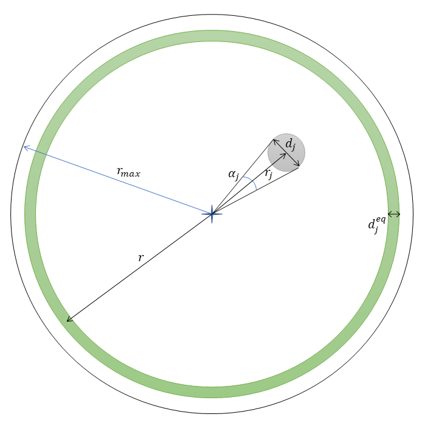

```{r DoNotModify, include=FALSE}
### Utilities. Do not modify.
# Installation of packages if necessary
InstallPackages <- function(Packages) {
  InstallPackage <- function(Package) {
    if (!Package %in% installed.packages()[, 1]) {
      install.packages(Package, repos="https://cran.rstudio.com/")
    }
  }
  invisible(sapply(Packages, InstallPackage))
}

# Basic packages
InstallPackages(c("bookdown", "formatR", "kableExtra", "ragg"))

# kableExtra must be loaded 
if (knitr::opts_knit$get("rmarkdown.pandoc.to") == "docx") {
  # Word output (https://stackoverflow.com/questions/35144130/in-knitr-how-can-i-test-for-if-the-output-will-be-pdf-or-word)
  # Do not use autoformat (https://github.com/haozhu233/kableExtra/issues/308)
  options(kableExtra.auto_format = FALSE)
}
library("kableExtra")

# Chunk font size hook: allows size='small' or any valid Latex font size in chunk options
def.chunk.hook  <- knitr::knit_hooks$get("chunk")
knitr::knit_hooks$set(chunk = function(x, options) {
  x <- def.chunk.hook(x, options)
  ifelse(options$size != "normalsize", paste0("\n \\", options$size,"\n\n", x, "\n\n \\normalsize"), x)
})
```

```{r Options, include=FALSE}
### Customized options for this document
# Add necessary packages here
Packages <- c("tidyverse", "dbmss", "GoFKernel", "magick", "corrplot", "spatstat.explore")
# Install them
InstallPackages(Packages)

# Crop images (requires package magick 
# and pdfcrop installed by tinytex::tlmgr_install("pdfcrop"))
knitr::knit_hooks$set(crop = knitr::hook_pdfcrop)
# knitr options
knitr::opts_chunk$set(
  cache =   FALSE,    # Cache chunk results
  crop =    TRUE,     # Crop fig margins in pdf  
  include = TRUE,     # Show/Hide chunks
  echo =    TRUE,     # Show/Hide code
  warning = FALSE,    # Show/Hide warnings
  message = FALSE,    # Show/Hide messages
  # Figure alignment and size
  fig.align = 'center', out.width = '80%',
  # Graphic devices (ragg_png is better than standard png)
  dev = c("ragg_png", "pdf"),
  # Code chunk format
  tidy = FALSE, tidy.opts = list(blank=FALSE, width.cutoff=50),
  size = "scriptsize", knitr.graphics.auto_pdf = TRUE
  )
options(width = 50)

# ggplot style
library("tidyverse")
theme_set(theme_bw())
theme_update(panel.background=element_rect(fill="transparent", colour=NA),
             plot.background=element_rect(fill="transparent", colour=NA))
knitr::opts_chunk$set(dev.args=list(bg="transparent"))

# Random seed
set.seed(973)
```

# Neutral NCI

## Definition

The clutter index of the tree neighbourhood (called focal") $i$ is defined by

$${NCI}_i = \sum_j^{r_{i,j} \leq r_{max}}{d_j^2 / r_{i,j}}.$$


where the neighbours indexed by $j$ located at distance $r_{i,j}$ from the reference tree (less than $r_{max}$ fixed at 10m) have diameter $d_j$.
ts dimension is a distance: $m^2 m^{-1}$.


## Reformulation

$d_j / r_{i,j}$ is the tangent of the apparent angle $\alpha_j$ of the neighbour $j$ from the point of view of the reference tree.
As the angles are small, the approximation $\alpha_j \approx \tan(\alpha_j)$ is valid.

The index can be rewritten
$${NCI}_i = \sum_j^{r_{i,j} \leq r_{max}}{d_j \alpha_j}.$$

The contribution of each neighbour is therefore the product of its apparent angle and its diameter.

There is no difference in the contribution to the clutter between a neighbour of diameter $d_j$ seen under the angle $\alpha_j$ and $n$ neighbours of the same diameter $d_j$ seen under the angle $\alpha_j / n$, for example because they are $n$ times further away.

(ref:voisinage) Equivalent diameter of neighbour $j$ for $\alpha = 2 \pi$.
```{r voisinage, fig.cap="(ref:voisinage)", echo=FALSE}

```

We can define (figure \@ref(fig:voisinage)) an equivalent diameter $d_j^{eq}$ for neighbour $j$ corresponding to an arbitrarily chosen apparent angle $\alpha$, which allows to characterize each neighbour by this single value such that

$${NCI}_i = \alpha \sum_j^{r_{i,j} \leq r_{max}}{d_j^{eq}}$$

where $d_j^{eq} = d_j \alpha_j / \alpha$.

The equivalent diameters of the neighbours are added together to define a total equivalent diameter of the neighbours of tree $i$:

$${NCI}_i = \alpha d_i^{eq}.$$

## Interpretation

By choosing $\alpha = 2 \pi$, we see that each neighbour $j$ contributes to ${NCI}_i$ as if its apparent angle were the full circle and its diameter was $d_j^{eq} = d_j^2 / (2 \pi r_{i,j})$.

For any radius $r$ around the tree $i$, chosen arbitrarily with respect only to $r \gg d_i^{eq}$, $2 \pi r d_i^{eq}$ is the area of the ring of width $d_i^{eq}$ centred on $r$ (the difference in perimeter between the inside and outside of the ring is negligible, and the ring can be assimilated to a rectangle of length $2 \pi r$ and of width $d_i^{eq}$)

The crowding index divided by $2pi$, i.e. ${NCI}_i / (2pi) = d_i^{eq}$, is therefore the width of a ring that completely encircles the reference tree $i$ at an arbitrary distance $r$.

Under the assumption of a completely random distribution of trees, $d_i^{eq}$, like ${NCI}_i$, is proportional to $r_{max}$.
In other words, the farthest trees contribute less but are more numerous: their total contribution is equivalent to that of the closest trees.
The most interesting metric is therefore
$${RCR}_i = d_i^{eq} / r_{max},$$
the proportion of the (one-dimensional) space crowded by neighbours, noted ${RCR}_i$ for *Radial Crowding Ratio*.


## Edge effect correction

Focal trees whose distance to the edge of the observation window (i.e., forest plot boundaries) is less than $r_{max}$ are generally ignored because part of their neighbourhood is not observed, resulting in an underestimate of their crowding.

The correction of @Ripley1977 can be applied to estimate the unobserved value of the NCI.
The contribution to the NCI of each neighbouring tree observed at distance $r_{i,j}$ is multiplied by a correction factor

$$mathrm{c}_{i,j}=$frac{2 \pi r}{\mathrm{l}(\mathrm{C}(i, r_{i,j}) \cap W)}$$

where $\mathrm{l(\cdot)}$ is the length of the part of the circle $\mathrm{C}(i, r_{i,j})$ centred on the point $i$ and of radius $r_{i,j}$ with the observation window $W$.

Intuitively, each neighbour observed at a sufficiently large distance from the focal point so that a part of the circle on which it is located is outside the plot sees its contribution increased inversely proportionally to the part of the circle contained in the plot, as if as many neighbours existed in the unobserved part as in the observed part.


# Application

## Data

Paracou plot 6::

```{r}
load("data/Paracou6.rda")
library("dbmss")
autoplot(Paracou6) + 
  ggplot2::labs(col = "Espèce", size = "Surface terrière")
```


## NCI calculation function

The `NCI()` function calculates the neutral clutter index around a focal tree.

```{r}
library("spatstat.geom")

#' NCI
#' 
#' Calculate NCI of point i
#'
#' @param i Index of a point of `ppp`.
#' @param ppp A planar point pattern.
#' @param distance_min The minimum distance of neighbors from the focal tree.
#' @param r_max The radius of the neighborhood
#' @param correct_edge_effects If `TRUE`, the Ripley correction of edge effects is applied,
#' else `NA` is returned for points too close to the edge of the window.
#'
#' @return The crowding index, in meters,
#' or `NA` if the point is too close to the edge of the window.
#' 
NCI <- function(i, ppp, distance_min = 0.25, r_max = 10, correct_edge_effects = TRUE) {
  # Neighborhood
  neighborhood <- ppp[disc(radius = r_max, centre = c(ppp$x[i], ppp$y[i]))]
  
  # Too close to the edge?
  is_too_close <- !is.subset.owin(neighborhood$window, ppp$window)
  if (is_too_close & !correct_edge_effects) {
    return(NA)
  }

  # Which is the center point?          
  center_point <- which(
    neighborhood$x == ppp$x[i] & 
    neighborhood$y == ppp$y[i] &
    neighborhood$marks$PointWeight == ppp$marks$PointWeight[i] & 
    neighborhood$marks$PointType == ppp$marks$PointType[i]
  )
  # Keep only one if several identical points have the same coordinates (unlikely)
  center_point <- center_point[1]
  # Distance from the center
  r_j <- pairdist(neighborhood)[, center_point]
  # Eliminate the center point
  r_j <- r_j[-center_point]
  # Set the minimum distance
  r_j <- pmax (r_j, distance_min)

  # Diameters
  d_j_squared <- neighborhood$marks$PointWeight * 4 / pi / 10000
  # Eliminate the center point
  d_j_squared <- d_j_squared[-center_point]
  # Normalized by distance.
  NCI_i_neutral <- d_j_squared / r_j
  
  # Edge effect correction
  if (is_too_close) {
    correction <- as.numeric(edge.Ripley(neighborhood[-center_point], r_j))
    NCI_i_neutral <- NCI_i_neutral * correction
  }
  
  return(sum(NCI_i_neutral))
}
```

The `RCR()` function calculates the neutral clutter index of all trees of a plot.

```{r}
#' Relative Crowding Ratio
#'
#' @param ppp A planar point pattern.
#' @param distance_min The minimum distance of neighbors from the focal tree.
#' @param r_max The radius of the neighborhood.
#' @param correct_edge_effects If `TRUE`, the Ripley correction of edge effects is applied,
#' points too close to the edge of the window are eliminated.
#'
#' @return A vector of relative crowding ratios of all points of `ppp`.
#' 
RCR <- function(ppp, distance_min = 0.25, r_max = 10, correct_edge_effects = TRUE) {
  # Compute NCI. vapply returns a matrix. Trees are in columns.
  NCI_i <- vapply(
    seq_len(ppp$n), 
    FUN = NCI,
    FUN.VALUE = 0,
    # Arguments
    ppp = ppp,
    distance_min = distance_min,
    r_max = r_max
  )
  # Eliminate points close to edges: neutral NCI is NA.
  NCI_i <- NCI_i[!is.na(NCI_i)]
  
  # Equivalent d
  d_i_eq <- NCI_i / 2 / pi
  
  # Crowding ratio
  return(d_i_eq / r_max)
}
```


## Calculating the NCI of plot 6

```{r}
# Compute crowding ratio
RCR_Paracou6 <- RCR(Paracou6)

# Distribution
RCR_median <- median(RCR_Paracou6)
library("GoFKernel")
plot(density.reflected(RCR_Paracou6, lower = 0), main = "")
abline(v = RCR_median, col = "red")
```

The median value of the crowding ratio is `r format(RCR_median * 1000, digits = 2)` per thousand.


## Checking for distance sensitivity

By multiplying the neighbourhood radius by 2, NCI should be approximately multiplied by 2 and the crowding ratio should be stable.
Increasing the radius eliminates points close to the edge of the plot and smoothes the neighbourhood data. 
The median is expected to be stable and the variability lower.

```{r}
# Compute crowding ratio
RCR_Paracou6_20 <- RCR(Paracou6, r_max = 20)

# Distribution
RCR_median_20 <- median(RCR_Paracou6_20)
plot(density.reflected(RCR_Paracou6_20, lower = 0), main = "")
abline(v = RCR_median_20, col = "red")
```

The median value of the crowding ratio is now `r format(RCR_median_20 * 1000, digits = 2)` per thousand.


## Conclusion

The RCR is used to interpret the clutter index.
It is the width (normalised by the neighbourhood radius) of a ring around the reference point whose NCI is identical to the observed value.
Its value is small: of the order of 3 to 4 per thousand.

```{r, include=FALSE}
# Compute crowding ratio
RCR_Paracou6_60 <- RCR(Paracou6, r_max = 60)

# Distribution
RCR_median_60 <- median(RCR_Paracou6_60)
```

Its definition is independent of the neighbourhood radius.
Its value in plot 6 is very stable: at 60m (neighbourhood > 1ha), its median is `r format(RCR_median_60 * 1000, digits = 2)` per thousand.
The choice of radius does not therefore modify the average crowding but its variability between trees.


# Non neutral NCI

## Definition

The clutter index of the neighbourhood of tree $i$ is defined by
$${NCI}_i = \sum_j^{r_j \leq r_{max}}{\lambda_{i,j} d_j^2 / r_j},$$
where $\lambda_{i,j}$ is a weighting depending on the hypothesis being tested. 
For example, $\lambda_{i,j}$ can be the absolute difference between the values of a functional trait of the $j$ tree and the $i$ focal tree to take into account the proximity of niches of neighbours.


## Geometric interpretation

The interpretation is similar to that of the neutral NCI.

For each neighbour, $d_j^{eq} = \lambda_j d_j \alpha_j / \alpha$.
By choosing $\alpha = 2 \pi$, each neighbour $j$ contributes to ${NCI}_i$ as if its apparent angle were the full circle and its diameter were $d_j^{eq} = \lambda_j d_j^2 / (2 \pi r_j)$.

The definition ${RCR}_i = d_i^{eq} / r_{max}$ does not change.
Just as $NCI_i$ can be negative, $d_i^{eq}$ and ${RCR}_i$ can be negative.
