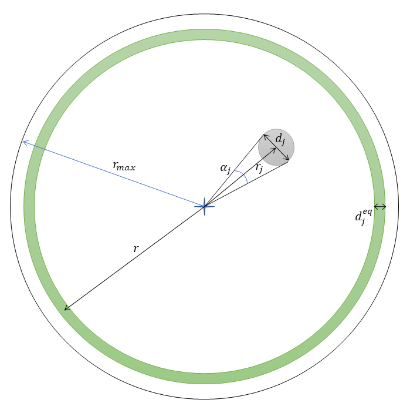

```{r}
#| label: DoNotModify
#| include: false
### Utilities. Do not modify.
# Installation of packages if necessary
InstallPackages <- function(Packages) {
  InstallPackage <- function(Package) {
    if (!Package %in% installed.packages()[, 1]) {
      install.packages(Package, repos="https://cran.rstudio.com/")
    }
  }
  invisible(sapply(Packages, InstallPackage))
}

# Basic packages
InstallPackages(c("bookdown", "formatR", "kableExtra", "ragg"))

# Chunk font size hook: allows size='small' or any valid Latex font size in chunk options
def.chunk.hook  <- knitr::knit_hooks$get("chunk")
knitr::knit_hooks$set(chunk = function(x, options) {
  x <- def.chunk.hook(x, options)
  ifelse(options$size != "normalsize", paste0("\n \\", options$size,"\n\n", x, "\n\n \\normalsize"), x)
})
```

```{r}
#| label: Options
#| include: false
### Customized options for this document
# Add necessary packages here
Packages <- c("tidyverse", "dbmss", "GoFKernel", "magick", "corrplot", "spatstat.explore")
# Install them
InstallPackages(Packages)

# Crop images (requires package magick 
# and pdfcrop installed by tinytex::tlmgr_install("pdfcrop"))
knitr::knit_hooks$set(crop = knitr::hook_pdfcrop)
# knitr options
knitr::opts_chunk$set(
  cache =   TRUE,     # Cache chunk results
  crop =    TRUE,     # Crop fig margins in pdf  
  include = TRUE,     # Show/Hide chunks
  echo =    TRUE,     # Show/Hide code
  warning = FALSE,    # Show/Hide warnings
  message = FALSE,    # Show/Hide messages
  # Figure alignment and size
  fig.align = 'center', out.width = '80%',
  # Graphic devices (ragg_png is better than standard png)
  dev = c("ragg_png", "pdf"),
  # Code chunk format
  tidy = FALSE, tidy.opts = list(blank=FALSE, width.cutoff=50),
  size = "scriptsize", knitr.graphics.auto_pdf = TRUE
  )
options(width = 50)

# ggplot style
library("tidyverse")
theme_set(theme_bw())
theme_update(panel.background=element_rect(fill="transparent", colour=NA),
             plot.background=element_rect(fill="transparent", colour=NA))
knitr::opts_chunk$set(dev.args=list(bg="transparent"))

# Random seed
set.seed(973)
```

# NCI neutre

## Définition

L'indice d'encombrement du voisinage de l'arbre (dit "focal") $i$ est défini [@Nemetschek2024] par

$${NCI}_i = \sum_j^{r_{i,j} \leq r_{max}}{d_j^2 / r_{i,j}}.$$

où les voisins indicés par $j$ situés à la distance $r_{i,j}$ de l'arbre de référence (inférieur à $r_{max}$ fixé à 10m) ont pour diamètre $d_j$.

Sa dimension est une distance : $m^2 m^{-1}$.


## Reformulation

$d_j / r_{i,j}$ est la tangente de l'angle apparent $\alpha_j$ du  voisin $j$ du point de vue de l'arbre de référence.

Comme les angles sont petits, l'approximation $\alpha_j \approx \tan(\alpha_j)$ est valide.

L'indice peut être réécrit

$${NCI}_i = \sum_j^{r_{i,j} \leq r_{max}}{d_j \alpha_j}.$$

La contribution de chaque voisin est donc le produit de son angle apparent par son diamètre.

Il n'y a pas de différence de contribution à l'encombrement entre un voisin de diamètre $d_j$ vu sous l'angle $\alpha_j$ et $n$ voisins de même diamètre $d_j$ vus sous l'angle $\alpha_j / n$, par exemple parce qu'ils sont $n$ fois plus loin.

(ref:voisinage) Diamètre équivalent du voisin $j$ pour $\alpha = 2 \pi$.
```{r voisinage, fig.cap="(ref:voisinage)", echo=FALSE}

```

On peut définir (figure \@ref(fig:voisinage)) un diamètre équivalent $d_j^{eq}$ pour le voisin $j$ correspondant à un angle apparent $\alpha$ arbitrairement choisi, ce qui permet de caractériser chaque voisin par cette seule valeur telle que 

$${NCI}_i = \alpha \sum_j^{r_{i,j} \leq r_{max}}{d_j^{eq}}$$

où $d_j^{eq} = d_j \alpha_j / \alpha$.

Les diamètres équivalents des voisins s'additionnent pour définir un diamètre équivalent total des voisins de l'arbre $i$:

$${NCI}_i = \alpha d_i^{eq}.$$

## Interprétation

En choisissant $\alpha = 2 \pi$, on voit que chaque voisin $j$ contribue à ${NCI}_i$ comme si son angle apparent était le cercle complet et que son diamètre était $d_j^{eq} = d_j^2 / (2 \pi r_{i,j})$.

Pour un rayon $r$ quelconque autour de l'arbre $i$, choisi arbitrairement en respectant seulement $r \gg d_i^{eq}$, $2 \pi r d_i^{eq}$ est la surface de la couronne de largeur $d_i^{eq}$ centrée sur $r$ (la différence de périmètre entre l'intérieur et l'extérieur de la couronne est négligeable, et la couronne peut être assimilée à un rectangle de longueur $2 \pi r$ et de largeur $d_i^{eq}$).

L'indice d'encombrement divisé par $2 \pi$, c'est-à-dire  ${NCI}_i / (2 \pi) = d_i^{eq}$, est donc la largeur d'une couronne qui encercle totalement l'arbre de référence $i$ à une distance $r$  arbitraire.

Sous l'hypothèse de la distribution complètement aléatoire des arbres, $d_i^{eq}$, comme ${NCI}_i$, est proportionnel à $r_{max}$.
Dit autrement, les arbres les plus lointains contribuent moins mais sont plus nombreux: leur contribution totale est équivalente à celle des arbres les plus proches.
La métrique la plus intéressante est donc

$${RCR}_i = d_i^{eq} / r_{max},$$
la proportion de l'espace (unidimensionnel) encombré par les voisins, noté ${RCR}_i$ pour *Radial Crowding Ratio*.


## Correction des effets de bord

Les arbres focaux dont la distance au bord de la fenêtre d'observation (c'est-à-dire des limites de la parcelle forestière) est inférieure à $r_{max}$ sont généralement ignorés parce qu'une partie de leur voisinage n'est pas observée, ce qui entraîne une sous-estimation de son encombrement.

La correction de @Ripley1977 peut être appliquée pour estimer la valeur non observée du NCI.
La contribution au NCI de chaque arbre voisin observé à la distance $r_{i,j}$ est multipliée par un facteur correctif
$$\mathrm{c}_{i,j}=\frac{2 \pi r}{\mathrm{l}(\mathrm{C}(i, r_{i,j}) \cap W)}$$
où $\mathrm{l(\cdot)}$ est la longueur de la partie du cercle $\mathrm{C}(i, r_{i,j})$ centré sur le point $i$ et de rayon $r_{i,j}$ avec la fenêtre d'observation $W$.

Intuitivement, chaque voisin observé à une distance assez grande du point focal pour qu'une partie du cercle sur lequel il se trouve soit hors de la parcelle voit sa contribution augmentée inversement proportionnellement à la partie du cercle contenue dans la parcelle, comme si autant de voisins existaient dans la partie non observée que dans la partie observée.


# Application

## Données

Parcelle 6 de Paracou:

```{r}
#| message: false
library("tidyverse")
read_csv2("data/Paracou6.csv") ->
  paracou_6
# Map
library("dbmss")
paracou_6 %>% 
  rename(X = Xfield, Y = Yfield, PointType = spName, PointWeight = CircCorr) %>% 
  wmppp() %>% 
  autoplot() + 
  ggplot2::labs(col = "Species", size = "Circumference")
```


## Fonction de calcul de NCI

La fonction `NCI()` calcule l'indice d'encombrement neutre autour d'un arbre focal.

```{r}
#| message: false
library("spatstat.geom")
library("cli")

#' NCI
#' 
#' Calculate the NCI of point i
#'
#' @param data Paracou style dataframe. 
#' Mandatory fields are idTree, Xfield, Yfield, CircCorr.
#' Contains a single measure campaign of a single plot.
#' @param plot_area The area (ha) of the plot that contains the data.
#' The plot is assumed to be square.
#' @param method The form of the NCI. 
#' May be "inv" for inverse distance, "invsq" for inverse distance to the square or "exp" for exponential decay.
#' @param distance_min The minimum distance of neighbors from the focal tree.
#' Distances zero are forced to the minimum.
#' @param r_max The radius of the neighborhood.
#' @param u The decay rate of the exponential model: a negative value.
#' @param correct_edge_effects If `TRUE`, the Ripley correction of edge effects is applied,
#' else `NA` is returned for points too close to the edge of the window.
#'
#' @return The crowding index, in meters,
#' or `NA` if the point is too close to the edge of the window.
#' 
NCI <- function(
    data, 
    plot_area = 6.25, 
    method = c("inv", "invsq", "exp"), 
    distance_min = 0.25, 
    r_max = 10, 
    u = -0.25, 
    correct_edge_effects = TRUE) {
  
  method <- match.arg(method) 
  
  # Define the square window
  window_size <- 100 * sqrt(plot_area)
  the_window <- square(window_size, unitname = c("meter", "meters"))
  
  # Filter points inside the window
  data  %>% 
    filter(Xfield >= 0 & Yfield >= 0 & Xfield <= window_size & Yfield <= window_size) ->
    data
  
  # Make a ppp
  the_ppp <- ppp(
    data$Xfield, 
    data$Yfield, 
    window = the_window
  )
  # id as mark
  marks(the_ppp) <- data.frame(
    id = data$idTree, 
    diameter = data$CircCorr / pi / 100
  )
  
  # Compute NCI
  the_NCI <- numeric(the_ppp$n)
  cli_progress_bar("Computing neighborhoods", total = the_ppp$n)
  for (i in seq_len(the_ppp$n)) {
    # Neighborhood
    neighborhood <- the_ppp[disc(radius = r_max, centre = c(the_ppp$x[i], the_ppp$y[i]))]
    # Too close to the edge?
    is_too_close <- !is.subset.owin(neighborhood$window, the_ppp$window)
    if (is_too_close & !correct_edge_effects) {
      the_NCI[i] <- NA
      next
    }
    # Which is the center point?          
    center_point <- which(neighborhood$marks$id == the_ppp$marks$id[i])
    # Distance from the center
    r_j <- pairdist(neighborhood)[, center_point]
    # Eliminate the center point
    r_j <- r_j[-center_point]
    # Set the minimum distance
    r_j <- pmax(r_j, distance_min)
  
    # Diameters
    d_j_squared <- neighborhood$marks$diameter^2
    # Eliminate the center point
    d_j_squared <- d_j_squared[-center_point]

    if (method == "inv") {
      # Normalized by distance
      NCI_i_neutral <- d_j_squared / r_j
    } else if (method == "invsq") {
      # Normalized by squared distance
      NCI_i_neutral <- d_j_squared / r_j^2
    } else if (method == "exp") {
      # Negative exponential
      NCI_i_neutral <- d_j_squared * exp(u * r_j)
    }
    # Edge effect correction
    if (is_too_close) {
      correction <- as.numeric(edge.Ripley(neighborhood[-center_point], r_j))
      NCI_i_neutral <- NCI_i_neutral * correction
    }
    # Sum neighbors
    the_NCI[i] <- sum(NCI_i_neutral)
    cli_progress_update()
  }
  cli_progress_done()
  return(the_NCI)
}
```

La fonction `RCR()` calcule l'indice d'encombrement neutre de tous les arbres d'une parcelle.

```{r}
#' Relative Crowding Ratio
#'
#' @param ppp A planar point pattern.
#' @param distance_min The minimum distance of neighbors from the focal tree.
#' @param r_max The radius of the neighborhood.
#' @param correct_edge_effects If `TRUE`, the Ripley correction of edge effects is applied,
#' points too close to the edge of the window are eliminated.
#'
#' @return A vector of relative crowding ratios of all points of `ppp`.
#' 
RCR <- function(
    data, 
    plot_area = 6.25, 
    method = c("inv", "invsq", "exp"), 
    distance_min = 0.25, 
    r_max = 10, 
    u = -0.25, 
    correct_edge_effects = TRUE) {
  
  # Compute NCI
  the_NCI <- NCI(
    data = data,
    plot_area = plot_area,
    method = method,
    distance_min = distance_min,
    r_max = r_max,
    u = u,
    correct_edge_effects = correct_edge_effects
  )
  # Crowding ratio
  return(the_NCI / 2 / pi / r_max)
}
```


## Calcul des NCI de la parcelle 6

```{r}
# Compute RCR
paracou_6_RCR_10 <- RCR(paracou_6, r_max = 10)


# Distribution
RCR_median <- median(paracou_6_RCR_10, na.rm = TRUE)
library("GoFKernel")
plot(density.reflected(paracou_6_RCR_10, lower = 0, na.rm = TRUE), main = "")
abline(v = RCR_median, col = "red")
```

La valeur médiane du ratio d'encombrement est `r format(RCR_median * 1000, digits = 2)` pour mille.


## Vérification de l'absence de sensibilité à la distance

En multipliant le rayon du voisinage par 2, NCI doit être approximativement multiplié par 2 et le ratio d'encombrement doit être stable.
L'augmentation du rayon élimine des points proche de la bordure de la parcelle et lisse les données de voisinage. 
On s'attend à ce que la médiane soit stable et la variabilité plus faible.

```{r}
# Compute crowding ratio
paracou_6_RCR_20 <- RCR(paracou_6, r_max = 20)

# Distribution
RCR_median_20 <- median(paracou_6_RCR_20, na.rm = TRUE)
plot(density.reflected(paracou_6_RCR_20, lower = 0, na.rm = TRUE), main = "")
abline(v = RCR_median_20, col = "red")
```

La valeur médiane du ratio d'encombrement est maintenant `r format(RCR_median_20 * 1000, digits = 2)` pour mille.


## Conclusion

Le RCR permet d'interpréter l'indice d'encombrement.
C'est la largeur (normalisée par le rayon du voisinage) d'une couronne autour du point de référence dont le NCI est identique à la valeur observée.
Sa valeur est faible : de l'ordre de 3 à 4 pour mille.

```{r}
#| include: false
# Compute crowding ratio
paracou_6_RCR_60 <- RCR(paracou_6, r_max = 60)

# Distribution
RCR_median_60 <- median(paracou_6_RCR_60, na.rm = TRUE)
```


Sa définition est indépendante du rayon du voisinage.
Sa valeur dans la parcelle 6 est très stable : à 60m (voisinage > 1ha), sa médiane est `r format(RCR_median_60 * 1000, digits = 2)` pour mille.
Le choix du rayon ne modifie donc pas l'encombrement moyen mais sa variabilité entre les arbres.


# NCI non neutre

## Définition

L'indice d'encombrement du voisinage de l'arbre $i$ est défini par
$${NCI}_i = \sum_j^{r_j \leq r_{max}}{\lambda_{i,j} d_j^2 / r_j},$$
où $\lambda_{i,j}$ est une pondération dépendant de l'hypothèse testée. 
Par exemple, $\lambda_{i,j}$ peut être la différence absolue entre les valeurs d'un trait fonctionnel de l'arbre $j$ et de l'arbre focal $i$ pour prendre en compte la proximité de niches des voisins.


## Interprétation géométrique

L'interprétation est similaire à celle du NCI neutre.

Pour chaque voisin, $d_j^{eq} = \lambda_j d_j \alpha_j / \alpha$.
En choisissant $\alpha = 2 \pi$, chaque voisin $j$ contribue à ${NCI}_i$ comme si son angle apparent était le cercle complet et que son diamètre était $d_j^{eq} = \lambda_j d_j^2 / (2 \pi r_j)$.

La définition ${RCR}_i = d_i^{eq} / r_{max}$ ne change pas.
De même que $NCI_i$ peut être négatif, $d_i^{eq}$ et ${RCR}_i$ peuvent être négatifs.


# Formes alternatives

## Définitions

Le NCI peut être défini [@Zambrano2020] comme
$${NCI}_i = \sum_j^{r_{i,j} \leq r_{max}}{d_j^2 / r_{i,j}^2},$$

c'est-à-dire que le carré des diamètres des voisins est pondéré par l'inverse du carré de leur distance par rapport à l'arbre focal.
L'argument `method` de la fonction `NCI()` est "invsq" pour appliquer cette formule.

La forme de décroissance exponentielle [@Schmitt2023] est
$${NCI}_i = \sum_j{d_j^2 e^{ur_{i,j}}},$$

où $u < 0$ est le taux de décroissance, -0,25 par défaut dans `NCI(method = "exp")`.

## Comparaison des méthodes

Les NCI sont calculés avec une distance maximale de 10 ou 20 mètres, avec les trois formes et sans correction des effets de bord.

```{r}
# Compare the methods.
NCI_inv_10 <- NCI(paracou_6, method = "inv", correct_edge_effects = FALSE)
NCI_inv_20 <- NCI(paracou_6, method = "inv", r_max = 20, correct_edge_effects = FALSE)
NCI_invsq_10 <- NCI(paracou_6, method = "invsq", correct_edge_effects = FALSE)
NCI_invsq_20 <- NCI(paracou_6, method = "invsq", r_max = 20, correct_edge_effects = FALSE)
NCI_exp_10 <- NCI(paracou_6, method = "exp", correct_edge_effects = FALSE)
NCI_exp_20 <- NCI(paracou_6, method = "exp", r_max = 20, correct_edge_effects = FALSE)
# Correlogram
library("ggcorrplot")
data.frame(
  d_10 = NCI_inv_10, 
  d_20 = NCI_inv_20, 
  d2_10 = NCI_invsq_10, 
  d2_20 = NCI_invsq_20, 
  exp_10 = NCI_exp_10,
  exp_20 = NCI_exp_20
) %>% 
  cor(use = "pairwise.complete.obs") %>% 
  round(2) %>% 
  ggcorrplot(type = "lower", lab = TRUE)
```

Tous les NCI sont fortement corrélés, à l'exception de la distance au carré et des décroissances exponentielles.
La méthode de la distance inverse limitée à 10 mètres (d_10) est bien corrélée avec toutes les autres, y compris la distance au carré.
Ceci peut être illustré par la courbe des facteurs, entre 0,25 et 20 mètres.

```{r}
d_max <- 20
curve(1/x^2, from = 0.25, to = d_max, log = "y", xlab = "distance", ylab = "factor")
curve(1/x, from = 0.25, to = d_max, add = TRUE, col = "red")
curve(exp(-.25 * x), from = .25, to = d_max, add = TRUE, col = "green")
```

La courbe verte représente l'inverse de la distance ($1/d$), la courbe rouge l'exponentielle ($e^{-d/4}$) et la courbe noire l'inverse de la distance au carré ($1/d^2$).
Les valeurs sont en logarithme.
On constate que, sauf pour les voisins très proches et jusqu'à 10 mètres, les facteurs de la distance inverse et de l'exponentielle négative sont très similaires. 
L'inverse de la distance au carré diminue beaucoup plus rapidement : il donne un poids très important aux voisins proches par rapport aux voisins éloignés.

L'avantage de la forme de décroissance exponentielle est qu'elle ne définit pas de coupure nette entre les arbres voisins et non voisins, mais son taux de décroissance est arbitraire.
Par ailleurs, seule la définition de l'inverse de la distance permet l'interprétation géométrique décrite ci-dessus.


`r if (knitr:::is_html_output()) '# Références {-}'`
